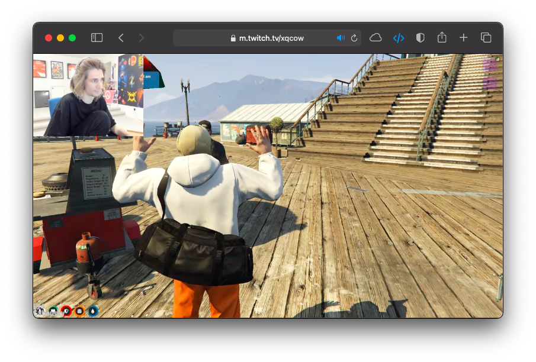
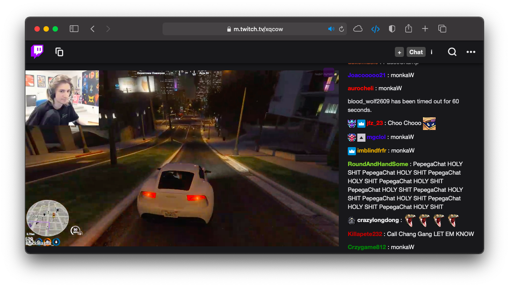

# better-mobile-twitch

This userscript allows some quality of life features on the mobile Twitch website. A user might want to use the mobile Twitch website on desktop since it has much better performance than the desktop version, which keeps the device cool and extends the battery life.

### Features Overview
* Automatically unmute when the page first loads
* Hide box area in chat (username/tag/follow/game area) to show more of chat content
* Remove chat input to show more of chat content
* Hide chat
* Hide navigation bar
* Pop-out chat in new tab

## Original user interface

## Stream-only mode

## Removed navigation bar and chat info

## Chat and navigation bar enabled with chat popout and chat toggle buttons, but without chat info

